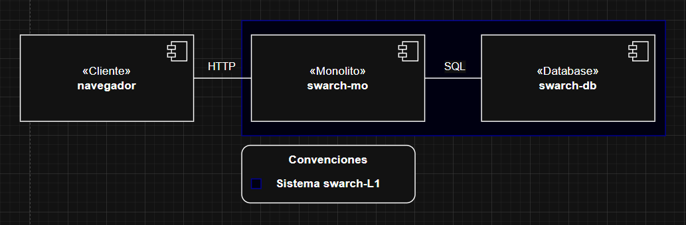
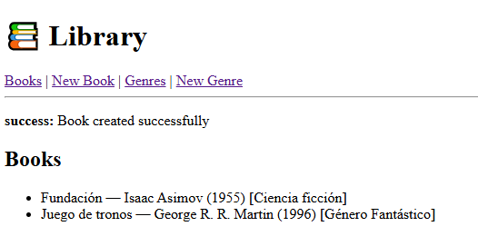
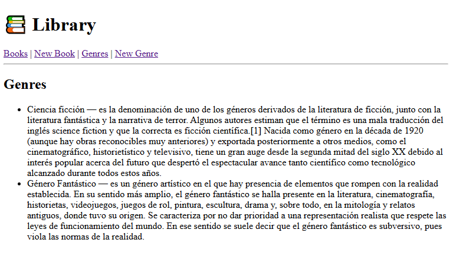
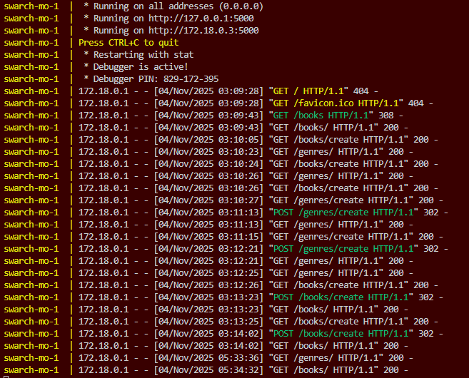
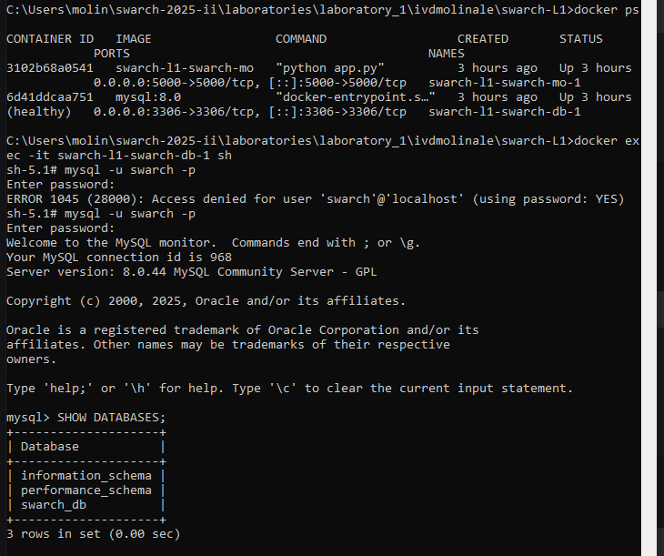
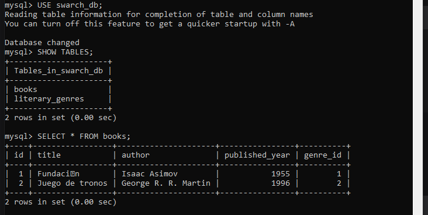
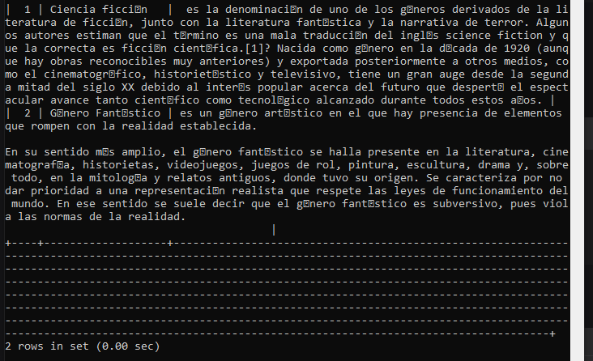

# Laboratorio 1 - Architectural Design

## Representación Arquitectónica

### Arquitectura C&C


### Estructura de Proyecto
```text
📁 swarch-L1/  
├── 🐳 Dockerfile  
├── 🐳 docker-compose.yaml  
└── 📁 app/  
    ├── 🐍 app.py              (Flask Application)  
    ├── 🐍 config.py           (Configuration)  
    ├── 📄 requirements.txt    (Dependencies)  
    ├── 📁 models/             (Data Layer)  
    │   ├── 🐍 __init__.py  
    │   ├── 🐍 book.py  
    │   └── 🐍 literary_genre.py  
    ├── 📁 repositories/       (Data Access Layer)  
    │   ├── 🐍 __init__.py  
    │   ├── 🐍 book_repository.py  
    │   └── 🐍 genre_repository.py  
    ├── 📁 services/           (Business Logic Layer)  
    │   ├── 🐍 __init__.py  
    │   ├── 🐍 book_service.py  
    │   └── 🐍 genre_service.py  
    ├── 📁 controllers/        (Presentation Layer)  
    │   ├── 🐍 __init__.py  
    │   ├── 🐍 book_controller.py  
    │   └── 🐍 genre_controller.py  
    └── 📁 templates/          (View Layer)  
        ├── base.html  
        ├── 📁 book/  
        │   ├── list.html  
        │   └── create.html  
        └── 📁 genre/  
            ├── list.html  
            └── create.html  
```

### Vista de Despliegue

## Propiedades del Sistema

### 1. Escalabilidad Vertical
La escalabilidad vertical se refiere a la capacidad del sistema para manejar incrementos en la carga de trabajo mediante la adición de recursos a la misma instancia existente. En esta arquitectura monolítica, todos los componentes (presentación, lógica de negocio, acceso a datos) están empaquetados en un único contenedor Docker, lo que permite escalar fácilmente aumentando los recursos computacionales asignados.

### 2. Mantenibilidad
La mantenibilidad representa la facilidad con la que el sistema puede ser modificado para corregir defectos, mejorar performance o adaptarse a cambios en el entorno. La implementación lograda sigue el principio de separación de concerns mediante capas bien definidas (models, repositories, services, controllers).

### 3. Portabilidad
La portabilidad es la capacidad del sistema para ejecutarse en diferentes entornos de hardware y software sin modificaciones significativas. El uso de Docker y contenedores proporciona un empaquetado consistente que abstrae las dependencias del sistema operativo subyacente.

### 4. Consistencia de Datos
La consistencia de datos garantiza que las operaciones sobre la información mantengan su integridad y cumplan con las reglas de negocio definidas, incluso en escenarios de acceso concurrente o fallos parciales del sistema.

### 5. Usabilidad
La usabilidad desde la perspectiva del usuario final se refiere a la facilidad con la que los usuarios pueden realizar tareas específicas dentro del sistema, incluyendo la intuitividad de la interfaz y la claridad del flujo de trabajo.

## Testing
### Generos literarios y Libros agregados


### Terminal

### Elementos evidenciados en Database 



